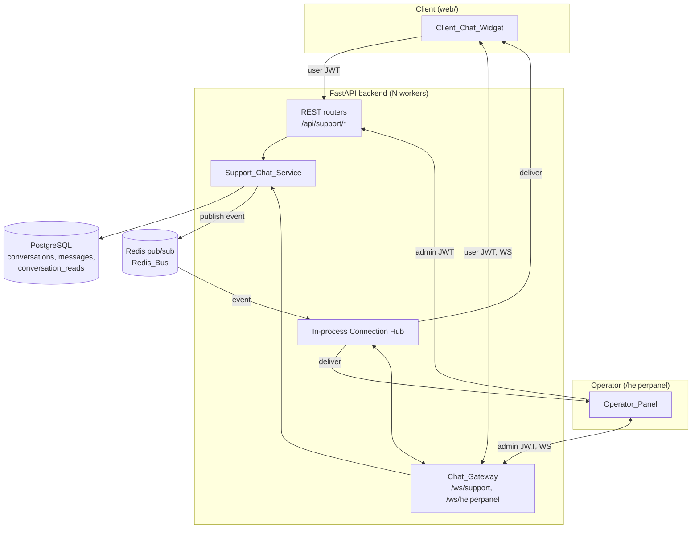
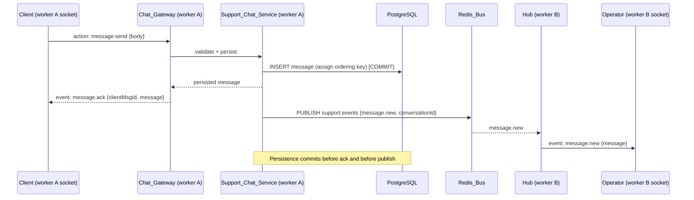

# Design Document

## Overview

This design specifies an in-app support chat that replaces the link-only
`SupportWidget` (`web/src/components/SupportWidget.tsx`) with a real two-sided
chat system:

- **Client side** — an authenticated in-app chat widget in the Next.js web app
  (`web/`), available on every page where the widget renders.
- **Operator side** — a dedicated operator UI served at `/helperpanel`, visually
  separate from the client site, where support staff log in, triage a list of
  conversations, reply in real time, assign conversations, change status, and see
  a client info card.

The backend is FastAPI (`backend/`). Real-time delivery uses WebSocket
connections terminated by a `Chat_Gateway`, with Redis pub/sub
(`backend/core/redis.py`) fanning events across workers so delivery works
regardless of which worker holds a socket (Requirement 15). All messages are
persisted to PostgreSQL **before** being confirmed or fanned out, so durable
storage is the source of truth and real-time is a best-effort delivery layer on
top of it (Requirements 14.1, 15.3, 15.4).

The operator account is **not** a new auth system. It reuses the existing admin
infrastructure: `AdminAccount` / `AdminRole` (`backend/models/admin_account.py`,
`backend/models/enums.py` — `AdminRole.OPERATOR` already exists and is verified
present), `AdminAuthSession`, PBKDF2 hashing and admin access/refresh JWTs with
`scope="admin"` (`backend/utils/admin_auth_utils.py`), and the admin auth router
(`backend/routers/admin/auth.py`). Client auth reuses the user JWT
(`backend/utils/auth_utils.py`, `backend/routers/auth.py`) and the web auth
context (`web/src/shared/auth/auth-context.tsx`).

### Key Design Decisions

1. **Durable-first ordering.** Every accepted message is written to the database
   and assigned a stable, monotonic ordering key inside the same transaction
   before any WebSocket confirm or Redis publish. Reconnecting clients reconcile
   purely from the database, so no message depends on the liveness of any socket
   (Requirements 14.1–14.4, 15.3, 15.4).

2. **Two WebSocket endpoints, one gateway.** `/ws/support` authenticates a
   client user JWT; `/ws/helperpanel` authenticates an admin JWT with an
   operator role. Splitting by path keeps authorization unambiguous and prevents
   a client token from ever reaching operator routing code (Requirement 8).

3. **Redis as a fan-out bus, not a store.** Workers subscribe to a small fixed
   set of Redis channels and route received events to their locally held
   sockets. If Redis is unavailable, persistence still succeeds and delivery
   degrades to same-worker / next-poll-on-reconnect (Requirement 15.3).

4. **`/helperpanel` as a Next.js route group with its own layout.** It lives
   under `web/src/app/helperpanel/` with a dedicated `layout.tsx` that does
   **not** wrap children in `PageShell` (so no `AppHeader`, `Footer`, or
   `SupportWidget`). This satisfies the "separate, dedicated operator interface"
   requirement (Requirement 7.1) while reusing the existing web toolchain rather
   than the legacy static `admin/` app.

5. **Per-operator unread via a read-marker table.** Unread is computed as "count
   of messages newer than this operator's last-read ordering key for this
   conversation," rather than a single shared counter. This makes
   Requirement 9.4 ("reset for that Operator's view") correct when multiple
   operators look at the same conversation.

## Architecture



### Message send/delivery flow (cross-worker)



### Component responsibilities

- **Client_Chat_Widget** (`web/src/features/support-chat/`): renders auth-gated
  chat UI, maintains the WebSocket, shows connection state, reconciles gaps on
  reconnect via REST history.
- **Operator_Panel** (`web/src/app/helperpanel/`): login screen, conversation
  list with status filter + unread badges, conversation view with thread, reply
  box, client info card, and assign/status controls.
- **Chat_Gateway** (`backend/realtime/chat_gateway.py`): authenticates each WS
  connection (client vs operator), parses inbound action envelopes, delegates to
  the service, and registers the socket with the local Connection Hub.
- **Support_Chat_Service** (`backend/services/support_chat_service.py`): the
  authoritative component. Creates conversations, validates and persists
  messages, enforces authorization, computes unread, mutates assignment/status,
  builds the client info card, and publishes events to the Redis_Bus.
- **Connection Hub** (`backend/realtime/connection_hub.py`): per-worker registry
  mapping `conversation_id` → set of local client sockets, and a set of local
  operator sockets. Subscribes to the Redis_Bus and dispatches received events
  to matching local sockets. Falls back to local-only dispatch when Redis is
  down.
- **Redis_Bus**: pub/sub transport for cross-worker fan-out.

## Components and Interfaces

### Backend modules (new)

| Module | Responsibility |
| --- | --- |
| `backend/models/support_conversation.py` | `SupportConversation` ORM model |
| `backend/models/support_message.py` | `SupportMessage` ORM model |
| `backend/models/support_conversation_read.py` | `SupportConversationRead` per-operator read marker |
| `backend/models/enums.py` (extend) | add `ConversationStatus`, `MessageAuthorType` enums |
| `backend/services/support_chat_service.py` | core domain logic, validation, events |
| `backend/realtime/connection_hub.py` | per-worker socket registry + Redis subscriber |
| `backend/realtime/chat_gateway.py` | WS endpoints, connection auth, envelope parsing |
| `backend/realtime/events.py` | event/envelope schema constants + serializers |
| `backend/routers/support.py` | client REST (`/api/support/*`) |
| `backend/routers/admin/support.py` | operator REST (`/api/admin/support/*`) |
| `backend/schemas/support_schemas.py` | Pydantic request/response models |
| `backend/utils/support_auth.py` | WS auth helpers + operator-role guard |

These are wired into `backend/main.py` (`include_router` for the two routers;
the WS endpoints are registered on `app`; the Connection Hub is started in the
`startup_event` and its Redis subscriber task is cancelled in `shutdown_event`).
The model modules are added to the `init_db()` import list.

### Support_Chat_Service interface (conceptual)

```python
class SupportChatService:
    async def get_or_create_conversation(self, db, user: User) -> SupportConversation: ...
    async def list_messages(self, db, conversation_id, *, before_key=None, limit=50) -> list[SupportMessage]: ...
    async def post_client_message(self, db, user: User, body: str) -> SupportMessage: ...
    async def post_operator_message(self, db, operator: AdminAccount, conversation_id, body: str) -> SupportMessage: ...
    async def list_conversations(self, db, operator: AdminAccount, *, status=None) -> list[ConversationSummary]: ...
    async def mark_read(self, db, operator: AdminAccount, conversation_id) -> None: ...
    async def assign(self, db, operator: AdminAccount, conversation_id, assign: bool) -> SupportConversation: ...
    async def set_status(self, db, operator: AdminAccount, conversation_id, status: ConversationStatus) -> SupportConversation: ...
    async def build_client_info_card(self, db, conversation_id) -> ClientInfoCard: ...
```

Validation helpers (pure, easily property-tested):

```python
def normalize_message_body(raw: str) -> str          # strip trailing/leading per policy
def validate_message_body(raw: str) -> ValidatedBody  # raises EmptyMessageError / MessageTooLongError
MAX_MESSAGE_LENGTH = 4000
```

### Connection Hub interface (per worker)

```python
class ConnectionHub:
    def register_client(self, conversation_id, socket) -> None
    def unregister_client(self, conversation_id, socket) -> None
    def register_operator(self, socket) -> None
    def unregister_operator(self, socket) -> None
    async def dispatch_local(self, event: ChatEvent) -> None   # send to matching local sockets
    async def publish(self, event: ChatEvent) -> None          # persist-after: push to Redis_Bus
    async def run_subscriber(self) -> None                     # background: Redis -> dispatch_local
```

## Data Models

### New enums (`backend/models/enums.py`)

```python
class ConversationStatus(str, Enum):
    OPEN = "open"
    IN_PROGRESS = "in_progress"
    CLOSED = "closed"

class MessageAuthorType(str, Enum):
    CLIENT = "client"
    OPERATOR = "operator"
```

### `SupportConversation`

| Column | Type | Notes |
| --- | --- | --- |
| `id` | UUID PK | `default=uuid4` |
| `user_id` | UUID FK → `users.id` | the owning Client; `unique=True` to enforce one conversation per client (Requirement 1.2/1.3) |
| `status` | enum `conversation_status` | default `open` (Requirement 12.1/12.2) |
| `assigned_operator_id` | UUID FK → `admin_accounts.id`, nullable | current assignee (Requirement 11) |
| `last_message_at` | timestamptz, nullable, indexed | ordering key for the operator list (Requirement 9.2) |
| `last_message_seq` | bigint, nullable | denormalized last message ordering key (tiebreak for list ordering) |
| `created_at` / `updated_at` | timestamptz | via `TimestampMixin` |

A unique constraint on `user_id` makes "get or create" a safe upsert and
guarantees each client has at most one conversation.

### `SupportMessage`

| Column | Type | Notes |
| --- | --- | --- |
| `id` | UUID PK | `default=uuid4` |
| `conversation_id` | UUID FK → `support_conversations.id`, indexed | |
| `seq` | bigint, **not null** | global monotonic ordering key from a Postgres sequence `support_message_seq` |
| `author_type` | enum `message_author_type` | `client` or `operator` |
| `author_user_id` | UUID FK → `users.id`, nullable | set when `author_type=client` |
| `author_admin_id` | UUID FK → `admin_accounts.id`, nullable | set when `author_type=operator` |
| `body` | Text, not null | validated non-empty, ≤ 4000 chars |
| `created_at` | timestamptz | `server_default=func.now()` |

**Ordering key (Requirements 14.2–14.4).** `seq` is drawn from a dedicated
PostgreSQL sequence (`CREATE SEQUENCE support_message_seq`) and is the single
sort key. Because a sequence is globally monotonic and gap-tolerant, it gives a
total order even when two messages share an identical `created_at` timestamp
(14.4). Display order within a conversation is always `ORDER BY seq ASC`.
Composite index `(conversation_id, seq)` backs history pagination.

> Rationale for `seq` over `(created_at, id)`: a UUID tiebreak is not
> chronological, so two near-simultaneous messages could sort in an order that
> contradicts arrival. A monotonic sequence assigned at insert time encodes
> arrival order deterministically and is cheap to paginate with keyset
> pagination (`WHERE conversation_id = ? AND seq < ? ORDER BY seq DESC LIMIT n`).

### `SupportConversationRead` (per-operator unread)

| Column | Type | Notes |
| --- | --- | --- |
| `id` | UUID PK | |
| `conversation_id` | UUID FK → `support_conversations.id`, indexed | |
| `operator_id` | UUID FK → `admin_accounts.id`, indexed | |
| `last_read_seq` | bigint, not null, default 0 | highest message `seq` this operator has seen |
| `updated_at` | timestamptz | |

Unique constraint on `(conversation_id, operator_id)`.

**Unread_Count for an operator** =
`COUNT(messages WHERE conversation_id = c AND author_type = 'client' AND seq > last_read_seq)`.
Only client-authored messages count toward unread (an operator's own replies are
never "unread"). Opening a conversation sets `last_read_seq` to the conversation's
current max `seq`, resetting unread to zero for that operator's view
(Requirement 9.4). Operators with no read row have `last_read_seq = 0`, so all
client messages are unread until first open.

### Alembic migration plan

One migration `e1a2b3c4d5e6_add_support_chat_tables.py`
(`down_revision` = current head `d9e2b4f5c601_add_telegram_admin_subscribers`):

1. `CREATE SEQUENCE support_message_seq` (and drop in `downgrade`).
2. Create enum types `conversation_status` and `message_author_type` via
   `postgresql.ENUM(...).create(bind, checkfirst=True)` (mirrors the existing
   `admin_account_role` migration pattern).
3. `create_table("support_conversations", ...)` with the unique index on
   `user_id`, FK to `admin_accounts.id` for `assigned_operator_id`, and an index
   on `last_message_at`.
4. `create_table("support_messages", ...)` with composite index
   `ix_support_messages_conversation_seq` on `(conversation_id, seq)`.
5. `create_table("support_conversation_reads", ...)` with the unique constraint
   on `(conversation_id, operator_id)`.
6. `downgrade()` drops tables (reverse order), then the two enums, then the
   sequence.

Because `init_db()` calls `Base.metadata.create_all`, the new model modules are
also added to its import list so fresh/dev databases get the tables; the Alembic
migration is the source of truth for production.

### WebSocket protocol

**Endpoints**

- `GET /ws/support` — client socket. Auth: user JWT (`token` query param or
  first-message handshake; see below). The socket is bound to the caller's own
  conversation; a client can never select another conversation.
- `GET /ws/helperpanel` — operator socket. Auth: admin JWT with role `OPERATOR`
  or `SUPER_ADMIN`. The socket can observe the conversation list and subscribe
  to specific conversations it opens.

**Connection authentication.** Browsers cannot set `Authorization` headers on
WebSocket handshakes, so the access token is passed as a `?token=` query
parameter and validated during `websocket.accept()`. The gateway runs the same
verifiers used by REST (`verify_access_token` for clients,
`verify_admin_access_token` + role check for operators). On failure the gateway
calls `websocket.close(code=4401)` and never registers the socket
(Requirements 3.3, 8.4, 8.5). A short-lived token is acceptable because the WS
layer also re-validates authorization for every state-changing action.

**Envelope.** All frames are JSON objects with a `type` discriminator.

Client/Operator → Server (actions):

| `type` | Payload | Allowed from |
| --- | --- | --- |
| `message.send` | `{ clientMsgId, body }` | client, operator (operator also sends `conversationId`) |
| `conversation.open` | `{ conversationId }` | operator |
| `conversation.markRead` | `{ conversationId }` | operator |
| `conversation.assign` | `{ conversationId, assign: bool }` | operator |
| `conversation.setStatus` | `{ conversationId, status }` | operator |
| `ping` | `{}` | both (keepalive) |

Server → Client/Operator (events):

| `type` | Payload | Sent to |
| --- | --- | --- |
| `message.ack` | `{ clientMsgId, message }` | the sender |
| `message.new` | `{ conversationId, message }` | conversation participants + operators |
| `unread.update` | `{ conversationId, unreadCount }` | operators |
| `conversation.updated` | `{ conversation }` (status, assignee, preview, lastMessageAt) | operators |
| `assignment.changed` | `{ conversationId, assignedOperator }` | operators |
| `status.changed` | `{ conversationId, status }` | operators + the conversation's client |
| `error` | `{ code, message, clientMsgId? }` | the sender |
| `pong` | `{}` | sender |

`message` is the canonical serialized `SupportMessage`
(`{ id, conversationId, seq, authorType, authorName, body, createdAt }`). The
`seq` field lets the frontend insert messages in stable order and detect gaps.

### Redis pub/sub channel design

To keep the subscriber model simple and worker count low, the design uses a
**single channel** `support:events` carrying every chat event as a JSON payload
that includes a `conversationId` and an audience hint
(`audience: "client" | "operators" | "both"`). Each worker runs one subscriber
task; on receiving an event it calls `ConnectionHub.dispatch_local`, which:

- for client-audience events, looks up local client sockets registered for that
  `conversationId` and sends to them;
- for operator-audience events, sends to all locally connected operator sockets
  (operators see list-level updates regardless of which conversation is open);
  conversation-scoped operator events (`message.new` for an open conversation)
  are filtered by the operator socket's currently-open `conversationId`.

> Why one channel instead of channel-per-conversation: conversations are
> long-lived and numerous, and operators need list-wide updates anyway. A single
> channel avoids dynamic subscribe/unsubscribe churn as operators open and close
> conversations, at the cost of each worker filtering events it does not need —
> a cheap in-memory set lookup. If event volume grows, this can later shard into
> `support:events:{hash(conversationId) % N}` without changing the envelope.

**Persist-before-publish ordering (Requirements 14.1, 15.1, 15.3).** The service
commits the message (and its `seq`) to PostgreSQL first, then publishes to
`support:events`. The producing worker also dispatches locally so same-worker
recipients do not depend on the Redis round-trip. If `get_redis_client()`
returns `None` (Redis down), the publish is skipped, persistence still succeeds,
and disconnected/cross-worker recipients reconcile via REST history on their next
fetch or reconnect (Requirement 15.4).

### REST endpoints

Client (user JWT; `backend/routers/support.py`, prefix `/api/support`):

| Method & path | Purpose | Auth | Response (in `data`) |
| --- | --- | --- | --- |
| `GET /api/support/conversation` | get-or-create the caller's conversation + first page of messages | user JWT | `{ conversation, messages, hasMore, oldestSeq }` |
| `GET /api/support/conversation/messages?beforeSeq=&limit=` | older history page (Requirement 5.3) | user JWT | `{ messages, hasMore, oldestSeq }` |
| `POST /api/support/conversation/messages` | send a message (REST fallback when WS down — Requirement 6.4 still relies on WS for live, but REST guarantees persistence) | user JWT | `{ message }` |

Operator (admin JWT + operator role; `backend/routers/admin/support.py`, prefix
`/api/admin/support`):

| Method & path | Purpose | Auth | Response (in `data`) |
| --- | --- | --- | --- |
| `GET /api/admin/support/conversations?status=` | list conversations w/ status, assignee, last preview, unread (Requirement 9.1, filter 12.6) | admin+operator | `{ conversations: ConversationSummary[] }` |
| `GET /api/admin/support/conversations/{id}` | open: messages oldest→newest + client info card; resets this operator's unread (9.4, 10.1, 13) | admin+operator | `{ conversation, messages, clientInfoCard }` |
| `GET /api/admin/support/conversations/{id}/messages?beforeSeq=&limit=` | older history page | admin+operator | `{ messages, hasMore, oldestSeq }` |
| `POST /api/admin/support/conversations/{id}/messages` | reply (REST persistence path; WS used for live) | admin+operator | `{ message }` |
| `POST /api/admin/support/conversations/{id}/assign` | assign/release self (Requirement 11) | admin+operator | `{ conversation }` |
| `POST /api/admin/support/conversations/{id}/status` | change status (Requirement 12) | admin+operator | `{ conversation }` |
| `POST /api/admin/support/conversations/{id}/read` | mark read (Requirement 9.4) | admin+operator | `{ unreadCount: 0 }` |

Operator login/refresh/logout reuse the existing admin auth router
(`/api/admin/auth/login`, `/refresh`, `/logout`, `/me`) unchanged
(Requirements 7.2–7.5). The Operator_Panel calls these directly; no new auth
endpoints are introduced.

`ClientInfoCard` shape (Requirement 13):
`{ phone, recentReservations: ReservationSummary[≤10], recentRentals: RentalSummary[≤10] }`,
each list ordered newest→oldest, empty arrays when none exist (13.3, 13.4).

### Authorization model

- **Endpoint separation (Requirements 8.1, 8.2).** Client routes depend on
  `get_current_client_user` (rejects admin tokens because they fail
  `verify_access_token`'s user-session lookup). Operator routes depend on a new
  `get_current_operator` that calls `get_current_admin` then asserts
  `admin.role in {OPERATOR, SUPER_ADMIN}`, raising `403` otherwise. A client
  user token presented to an operator route fails admin verification → `401/403`;
  it can never reach operator logic.
- **Ownership (Requirements 5.2, 8.3).** Client message/history queries are
  always scoped by `conversation.user_id == current_user.id`. A client requesting
  any conversation that is not their own receives `403`/`404`; the API never
  accepts a client-supplied conversation id for reads beyond verifying ownership.
- **WS auth (Requirements 8.4–8.6).** The gateway authenticates before
  registering the socket. Operator `message.send` re-checks the operator role and
  conversation existence at action time; an operator socket that lost
  authorization (revoked session) is rejected and no message is persisted.
- **Unauthenticated WS (Requirements 3.3, 8.5).** Missing/invalid token →
  immediate `close(4401)` with no hub registration and no guest state.

## Correctness Properties


*A property is a characteristic or behavior that should hold true across all
valid executions of a system — essentially, a formal statement about what the
system should do. Properties serve as the bridge between human-readable
specifications and machine-verifiable correctness guarantees.*

The support chat has substantial pure domain logic — body validation, monotonic
ordering, keyset pagination, unread computation, ownership checks, the
conversation list merge reducer, and dispatch routing — which is well suited to
property-based testing. UI rendering, connection/transport behavior, real-time
latency, and infrastructure wiring are covered by example and integration tests
instead (see Testing Strategy). The properties below were derived from the
prework analysis and consolidated to remove redundancy.

### Property 1: Conversation get-or-create is idempotent and yields one open conversation per client

*For any* client and *any* number of repeated `get_or_create_conversation`
calls, the result is the same conversation, exactly one conversation row exists
for that client, it is owned by that client's user id, and a freshly created
conversation has status `open`.

**Validates: Requirements 1.1, 1.2, 1.3, 12.2**

### Property 2: Valid messages persist with correct author fields and round-trip

*For any* valid (non-whitespace, ≤ 4000 character) body and *any* author (client
or operator), posting the message persists exactly one `SupportMessage` whose
`author_type` matches the author kind, whose author id is set on the matching
column (`author_user_id` for clients, `author_admin_id` for operators), whose
`body` equals the submitted text, and which is subsequently retrievable in that
conversation.

**Validates: Requirements 2.1, 2.2, 10.2**

### Property 3: Message body validation accepts iff trimmed length is in [1, 4000]

*For any* string, `validate_message_body` accepts it if and only if its trimmed
content is non-empty and at most 4000 characters; whitespace-only, empty, and
over-length strings are rejected and persist no message, regardless of whether
the author is a client or an operator.

**Validates: Requirements 2.3, 2.4, 10.5**

### Property 4: Ordering keys are strictly increasing and retrieval is deterministically ordered

*For any* sequence of messages inserted into a conversation, the assigned `seq`
values are unique and strictly increasing in insertion order, and retrieving the
conversation's messages always returns them in ascending `seq` order — including
when two messages share an identical `created_at` timestamp, in which case the
order between them is stable across repeated retrievals.

**Validates: Requirements 14.2, 14.3, 14.4, 5.1, 10.1**

### Property 5: Keyset pagination reproduces the full ordered history exactly

*For any* conversation history and *any* page size, fetching successive older
pages by `beforeSeq` and concatenating them reproduces the complete
`seq`-ordered message list with every message appearing exactly once (no gaps,
duplicates, or overlaps).

**Validates: Requirements 5.3**

### Property 6: Clients can read only their own conversation's messages

*For any* two distinct clients each with their own conversation and messages, a
client's history/conversation query returns only messages belonging to that
client's own conversation, and any attempt to read another client's conversation
is denied.

**Validates: Requirements 5.2, 8.3**

### Property 7: Operator access is granted exactly to operator and super-admin roles

*For any* admin account, the operator-access decision grants access if and only
if the account's role is `OPERATOR` or `SUPER_ADMIN`, and denies it for every
other role.

**Validates: Requirements 7.6, 8.2**

### Property 8: Message-list merge yields a deduplicated, seq-ascending list

*For any* arrival sequence (any permutation, with possible duplicates) of
messages delivered to the client/operator message-list reducer, the resulting
visible list is ordered strictly ascending by `seq` and contains each message id
exactly once.

**Validates: Requirements 4.2, 10.4**

### Property 9: Reconnection reconciliation matches the persisted conversation

*For any* persisted ordered message list and *any* locally known subset of it,
reconciling by retrieving messages with `seq` greater than the local maximum
produces a local list equal to the full persisted ordered list, with no gaps or
duplicates.

**Validates: Requirements 6.3, 15.4**

### Property 10: Per-operator unread count is consistent and reset on open

*For any* conversation and *any* operator, the operator's Unread_Count equals the
number of client-authored messages whose `seq` exceeds that operator's
`last_read_seq`; sending a new client message increases that count by one
relative to a fixed read marker; and opening/marking the conversation read sets
the count to zero for that operator only, leaving every other operator's count
unchanged.

**Validates: Requirements 9.1, 9.3, 9.4**

### Property 11: Conversation summaries carry correct status, assignee, preview, and unread

*For any* set of conversations with messages and read markers, each conversation
summary returned to an operator reports the conversation's actual status, its
actual assigned operator (or none), a preview equal to the most recent message,
and the unread count computed for the requesting operator.

**Validates: Requirements 9.1**

### Property 12: Conversation list is ordered by most recent activity, newest first

*For any* set of conversations, the operator conversation list is ordered by
`last_message_at` descending, with `last_message_seq` as a deterministic
tiebreak.

**Validates: Requirements 9.2**

### Property 13: Status filter returns exactly the conversations with that status

*For any* set of conversations and *any* chosen status filter, the filtered list
contains every conversation with the selected status and no conversation with a
different status.

**Validates: Requirements 12.6**

### Property 14: A client message reopens a closed conversation

*For any* conversation, when a client posts a message, a conversation whose
status is `closed` transitions to `open`, while conversations in other statuses
retain their status.

**Validates: Requirements 12.4**

### Property 15: Status changes round-trip through persistence

*For any* conversation and *any* target status in `{open, in_progress, closed}`,
applying `set_status` and then reloading the conversation returns that exact
status.

**Validates: Requirements 12.3**

### Property 16: Assign-then-release returns a conversation to unassigned

*For any* unassigned conversation, assigning it to an operator records that
operator as the assignee, and a subsequent self-release by that operator records
the conversation as unassigned (round trip).

**Validates: Requirements 11.1, 11.4**

### Property 17: Client info card reflects only the owning client's data within limits

*For any* conversation, the client info card reports the owning client's phone,
includes only reservations and rentals belonging to that client's user id,
returns at most the 10 most recent of each ordered newest→oldest, and returns
empty lists (without error) when the client has no reservations or rentals.

**Validates: Requirements 13.1, 13.2, 13.3, 13.4**

### Property 18: Event dispatch selects the correct local recipients

*For any* set of locally registered sockets (client sockets grouped by
conversation, operator sockets with a currently-open conversation) and *any*
chat event with an audience and conversation id, the computed recipient set is
exactly: the client sockets of that conversation for client-audience events; all
operator sockets for operator list-level events; and only operator sockets whose
open conversation matches for conversation-scoped operator events.

**Validates: Requirements 15.2**

## Error Handling

- **Validation errors (Requirements 2.3, 2.4, 10.5).** `validate_message_body`
  raises `EmptyMessageError` → HTTP `422` / WS `error{code:"EMPTY_MESSAGE"}`, and
  `MessageTooLongError` → HTTP `422` / WS `error{code:"MESSAGE_TOO_LONG", limit:4000}`.
  No message is persisted on validation failure.
- **Auth errors.** REST follows the existing pattern: `401` for missing/invalid
  tokens (`extract_bearer_token`, `verify_*_token`), `403` for role/ownership
  violations. WS auth failures close the socket with `4401` before registration.
- **Ownership errors (Requirement 8.3).** A client reading a non-owned
  conversation returns `403`; unknown ids return `404`. The handler never leaks
  another client's data.
- **Redis unavailable (Requirement 15.3).** Publishing is wrapped so a Redis
  outage logs a warning and is swallowed after the DB commit; the message is
  already durable. The `get_redis_client() is None` path skips publish entirely.
  Recipients reconcile via REST history on reconnect.
- **Optimistic status failure (Requirement 12.5).** The Operator_Panel applies
  the status change locally and shows a non-blocking "not yet saved" badge if the
  `POST .../status` request fails, retrying in the background; it does not roll
  back the operator's view.
- **Disconnected send (Requirement 6.4).** When the socket is not `connected`,
  the widget marks the outgoing message as "not sent" rather than showing it as
  delivered, and offers a retry once reconnected.
- **WS keepalive.** `ping`/`pong` frames plus a server-side idle timeout detect
  dead sockets; on close the hub unregisters the socket.

## Testing Strategy

### Dual approach

- **Property-based tests** verify the universal properties above across many
  generated inputs (validation, ordering, pagination, unread math, ownership,
  role predicate, list merge, dispatch routing, card content). These test pure
  and DB-backed domain logic in `Support_Chat_Service` and the frontend reducers.
- **Unit / example tests** cover concrete behaviors and edge UI states:
  connection-state indicator, login prompt for unauthenticated users, optimistic
  status badge, disconnected-send indicator, and the admin-auth wiring for
  operators (login/refresh/logout, bad credentials).
- **Integration tests** cover transport and infrastructure that does not vary
  with input: WS connect/reject (4401), end-to-end operator→client delivery,
  cross-worker fan-out via Redis (publish on one worker, receive on another),
  the 2-second delivery expectations, and persistence-before-ack ordering.
- **Smoke test** verifies `/helperpanel` renders its dedicated layout (no
  `AppHeader`/`Footer`/`SupportWidget`).

### Property-based testing setup

- **Backend:** use **Hypothesis** (Python) for service-layer properties. DB-backed
  properties run against a transactional test database (PostgreSQL) with rollback
  per example; pure helpers (`validate_message_body`, the seq/ordering logic,
  dispatch routing, unread computation) are tested without I/O where possible.
- **Frontend:** use **fast-check** (TypeScript) for the message-list merge
  reducer and gap-reconciliation logic (Properties 8, 9), which are pure
  functions over message arrays.
- Do **not** implement property generators or a PBT engine from scratch; use the
  libraries above.

### Configuration and tagging

- Each property-based test runs a **minimum of 100 iterations** (Hypothesis
  `max_examples=100+`, fast-check `numRuns: 100+`).
- Each property test is implemented as a **single** property-based test and is
  tagged with a comment referencing its design property, in the format:
  `Feature: support-chat, Property {number}: {property_text}`.
- Integration tests for real-time delivery use 1–3 representative examples rather
  than high iteration counts.

### Coverage notes

- Properties 1–7, 10–17 target `Support_Chat_Service` and its REST surface.
- Property 18 targets `ConnectionHub.dispatch_local` recipient selection (pure
  set computation), separated from the socket I/O it drives.
- Properties 8–9 target frontend reducers and are the client-side counterpart to
  the backend ordering/reconciliation guarantees.
